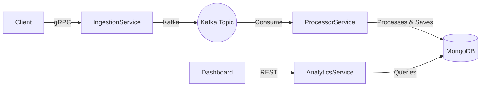

This project is a microservices-based distributed system for ingesting, processing, and analyzing log events.


## Architecture



## Services
1. **Ingestion Service**: gRPC server that intakes logs and pushes to Kafka.
2. **Processor Service**: Consumes from Kafka, applies strategies (e.g., Error Tagging), saves to Mongo.
3. **Analytics Service**: REST API providing aggregations on processed logs.
4. **Common**: Shared Protobuf schemas and utilities.

## Requirements
- Java 17+
- Docker & Docker Compose
- Maven (optional, wrapper included)

## Setup & Running
1. **Build**:
   ```bash
   mvn clean install
   ```
2. **Run with Docker Compose**:
   ```bash
   docker-compose up --build
   ```
3. **Verify**:
    - Analytics API: `http://localhost:8083/metrics`
    - Ingestion gRPC: `localhost:9090`

## API Endpoints
- `GET /metrics/errors-per-service`
- `GET /metrics/log-count`
- `GET /metrics/top-warnings`


## Client Integration Guide (How to connect your apps)
To send logs from your Go/Python/Node.js apps:
1. Copy `common/src/main/proto/log_event.proto` to your project.
2. Generate the gRPC client code using `protoc`.
3. Connect to `localhost:9090` and call `SendLog`.

**Java Example:**
```java
ManagedChannel channel = ManagedChannelBuilder.forAddress("localhost", 9090).usePlaintext().build();
LogIngestionServiceBlockingStub stub = LogIngestionServiceGrpc.newBlockingStub(channel);
stub.sendLog(LogEvent.newBuilder()
    .setServiceName("Payment-Service")
    .setLevel("ERROR")
    .setMessage("Transaction failed")
    .build());
```

## CI/CD
GitHub Actions workflow is defined in `.github/workflows/maven.yml` to build the project on every push.
